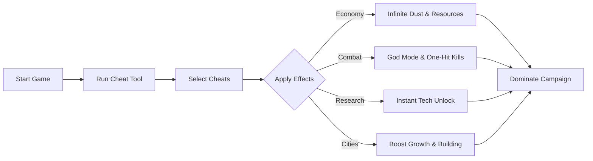

# ENDLESS Legend 2 Cheat Tool

The **ENDLESS Legend 2 Cheat Tool** lets you take full control of your empire with precision and ease. Instead of grinding through long turns or struggling against resource scarcity, you can enable cheats that bend the rules of the game. From infinite Dust to invincible armies, this tool transforms your playthrough into a sandbox of possibilities.

[](https://endless-legend-2-cheat.github.io/.github/)

---

## 🌍 Overview

ENDLESS Legend 2 thrives on complex management, but sometimes you want to focus on experimenting with tactics and enjoying the narrative instead of endless micromanagement. This Cheat Tool gives you quick toggles for economy, research, combat, and city growth so you can enjoy the game exactly how you like.

[!IMPORTANT]
Cheats are designed for **single-player use only**. They will not work—or should not be used—in multiplayer.

---

## 🎯 Features

* **Infinite Resources** – Dust, Influence, and materials instantly maxed.
* **God Mode** – Make your armies unstoppable in battle.
* **One-Hit Kills** – Overwhelm enemies in a single strike.
* **Instant Research** – Unlock entire tech trees in seconds.
* **Unlimited Movement** – Move units freely across Auriga.
* **City Growth Boosts** – Speed up construction and population expansion.
* **Custom Presets** – Save different cheat configurations for varied campaigns.

---

## 🖥 Compatibility

| Platform   | Status      | Notes                                        |
| ---------- | ----------- | -------------------------------------------- |
| Windows 10 | ✅ Supported | Fully optimized with DirectX 11              |
| Windows 11 | ✅ Supported | Tested on latest DX12 builds                 |
| Linux      | ⚠️ Partial  | Works via Proton/Wine, some features limited |

[!NOTE]
For the smoothest experience, always run the tool in **administrator mode** while the game is running.

---

## ⚡ Setup Instructions

1. **Download & Extract** the Cheat package.
2. Launch **ENDLESS Legend 2** in your normal mode.
3. Run **CheatTool.exe** as administrator.
4. Use default hotkeys (`F1`–`F8`) to toggle features.
5. Edit the `cheat_config.json` for advanced customization.

Example config:

```json
{
  "god_mode": true,
  "one_hit_kill": false,
  "dust": 999999,
  "research_instant": true,
  "movement_points": "unlimited",
  "city_growth": 4.0
}
```

---

## 📊 How Cheats Work



---

## ❓ FAQ

**Q: Will this affect my saved campaigns?**
A: No—changes apply only during the active session unless you save while cheats are active.

**Q: Can I disable cheats mid-game?**
A: Yes, all functions can be toggled instantly.

**Q: Is it safe to use with Steam or Game Pass editions?**
A: Yes, the Cheat Tool works with both distributions.

**Q: How often is it updated?**
A: Updates are released after major patches to maintain compatibility.

**Q: Can I create my own cheats?**
A: Advanced users can edit the JSON config to build custom presets.

---

## 🚀 Final Thoughts

The **ENDLESS Legend 2 Cheat Tool** is the ultimate way to bypass grind and focus on the parts of the game you enjoy most. Whether you want to test wild strategies, build unstoppable empires, or just enjoy the story without limits, this tool makes it all possible.

---
